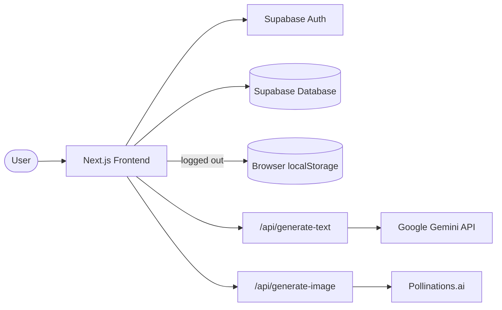
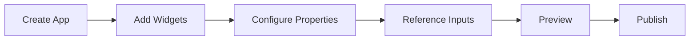

# Forge

**A no-code AI app builder for non-technical teams.** Drag widgets onto a canvas, wire them together with plain-language prompts, preview the result, and publish a standalone app — no engineering ticket required.

> Status: active build. Phases 1–4 (shell, builder canvas, properties/validation, real AI), Phase 5 (multi-app storage, app management, public app route, mock publishing, real image generation, publish/draft correctness), and Phase 6 (Supabase auth, profile setup, cloud persistence, local-app import, password reset) are complete. See [`docs/project-status.md`](docs/project-status.md) for the detailed feature matrix and [`docs/case-study-notes.md`](docs/case-study-notes.md) for the design narrative.

## Live Demo

> _Add the deployed URL here once a current build is redeployed — e.g. `https://forge-ai-builder.vercel.app/dashboard`._

---

## What Forge Is

Forge lets a marketing, support, ops, or product teammate build a small AI-powered web app — an FAQ chatbot, a lead qualifier, a product description generator — by:

1. Dropping widgets onto a canvas
2. Filling in plain-language properties (no JSON, no schema, no "nodes")
3. Referencing other widgets' values inside a prompt
4. Previewing the live result
5. Publishing it to a standalone, shareable-looking URL

The mental model sits between Retool/Appsmith (visual builder) and a workflow tool (AI-native), but trimmed down to exactly what a non-technical user needs.

## Problem Statement

Non-technical teams constantly want small, focused AI tools — a chatbot that answers FAQs, a generator that writes product descriptions, a form that scores leads — but building even a simple one today means either:

- Filing a ticket with engineering and waiting in a backlog for something that should take an afternoon, or
- Wrestling with a general-purpose no-code platform (Retool, Appsmith) that exposes databases, APIs, and technical concepts the user was never trained on.

Forge's bet: most of these tools don't need a database connection or a REST API panel. They need a handful of widget types, a way to reference one widget's value from another, a connection to a real LLM, and a button that makes the result something other people can open. Strip everything else away.

## Target Users

Non-technical teammates in marketing, support, operations, and product roles who want to self-serve a small AI tool. They are comfortable with spreadsheets and SaaS dashboards, not with code, JSON, or API documentation. Example apps they'd build:

- FAQ chatbot
- Lead qualifier
- Product description generator
- Social caption generator
- Image prompt generator
- Internal workflow assistant
- Learning assistant

## Current Features

| Area | Status |
|---|---|
| Dashboard, Discover (template gallery) | Built, seeded with mock data |
| **My Apps** | Built — real saved apps, Drafts/Published split |
| Builder canvas — add/drag/select/delete widgets | Built |
| Widget properties panel | Built, per-widget-type fields |
| Prompt reference system (`{{widget.value}}`) | Built |
| Validation + publish-readiness checklist | Built |
| Preview mode | Built |
| **Text Generator widget → real Gemini API** | Built — server-side route, model fallback chain, mock fallback |
| **Image Generator widget → real Pollinations.ai image API** | Built — server-side route, no API key needed, mock fallback |
| Chat Box widget | Polished mock only (no real API calls yet) |
| **Multi-app storage** | Built — local or cloud, per app, with rename/duplicate/delete |
| **Mock-to-real publishing** | Built — flips an app's status, viewable at a runtime URL |
| **Publish/draft correctness** | Built — editing a published app reverts it to draft until republished |
| **Authentication (Supabase Auth)** | Built — sign up, log in, log out, password reset |
| **Profile setup** (username + avatar) | Built — required after first login, drives the sidebar/greeting identity |
| **Cloud persistence (Supabase)** | Built — logged-in users' apps live in Postgres, not just the browser |
| **localStorage fallback** | Built — logged-out users keep a fully working local-only experience |
| **Local app import after login** | Built — offers to copy locally-saved apps into the new cloud account, never deletes the local copy |
| Real hosting/CDN for published apps | Partial — published apps saved to Supabase are reachable from any browser; logged-out/local-only published apps remain browser-bound |

Full detail in [`docs/project-status.md`](docs/project-status.md).

## Tech Stack

- **Next.js 16** (App Router, Turbopack)
- **React 19**
- **TypeScript** throughout
- **Tailwind CSS v4** (CSS-first `@theme` config, no `tailwind.config.js`)
- **Supabase** — Auth (email/password, password reset) and Postgres (apps + profiles, with Row Level Security)
- **Google Gemini API** (`gemini-2.5-flash-lite` → `gemini-2.5-flash` → `gemini-2.0-flash` fallback chain) for real text generation, called server-side only
- **Pollinations.ai** (free, keyless public image API) for real image generation, called server-side only
- **localStorage** — fallback persistence for logged-out users

Planned but not yet introduced: React Flow (canvas), Zustand (global state), Radix UI, Zod — see [`docs/architecture.md`](docs/architecture.md) for why the current canvas is hand-built instead.

## AI Providers Used

| Widget | Provider | Why this one | Needs a key? |
|---|---|---|---|
| Text Generator | Google Gemini (`gemini-2.5-flash-lite` → `gemini-2.5-flash` → `gemini-2.0-flash`) | Free tier, no SDK needed, called via raw `fetch` | Yes — `GEMINI_API_KEY` |
| Image Generator | Pollinations.ai | Genuinely free and keyless — chosen after Google made every Gemini image model ("Nano Banana") and the standalone Imagen models paid-only, confirmed by testing all of them directly against the live API | No |
| Chat Box | None (mocked) | Explicitly out of scope so far — keyword-matched canned replies | — |

Both real-provider widgets follow the same shape: one server-only route, the API key (if any) never reaches the browser, and any provider failure (quota, network, safety block) falls back to a polished mock rather than a broken UI.

## Supabase Auth and Database Persistence

Forge uses [Supabase](https://supabase.com) for accounts and cloud data, added in Phase 6 without changing any builder, AI, or local-storage behavior:

- **Auth** — email/password sign-up and login, logout, and a full forgot-password → email link → set-new-password flow, all via `@supabase/ssr` (browser + server clients, with session refresh in `src/proxy.ts`).
- **Profile setup** — first login after signup routes to `/profile-setup`, where the user picks a username and an avatar (one of 8 fixed emoji presets — no image uploads, no storage bucket needed). This becomes the identity shown in the sidebar and the dashboard greeting.
- **Database** — two tables, `profiles` and `apps` (schema in [`docs/supabase-schema.sql`](docs/supabase-schema.sql)), both with Row Level Security: a user can only read/write their own rows, except published apps, which are publicly readable so `/app/[appId]` works for anyone with the link.
- **Cloud app storage** — when logged in, all app CRUD (`list`/`get`/`create`/`save`/`duplicate`/`delete`/`publish`) goes through `src/lib/cloudStorage.ts` instead of `localStorage`.

## LocalStorage Fallback

Logged-out users are not blocked from using Forge — `src/lib/appStore.ts` is a thin auth-aware dispatcher that checks the current Supabase session and routes every storage call to either `src/lib/cloudStorage.ts` (logged in) or the original `src/lib/storage.ts` (logged out), with identical function signatures on both sides. The pre-existing local-only behavior from Phase 5 was never modified — only added to. After logging in, if local apps exist that aren't yet in the cloud, My Apps shows a one-time banner offering to import them; declining or dismissing leaves the local copies untouched and re-offers next time.

## Text Generation Flow (Gemini)

1. In Preview mode (or on the published runtime page), the user clicks **Generate**.
2. The client resolves `{{widgetId.value}}` tokens in the prompt against live widget values.
3. The resolved prompt is POSTed to `/api/generate-text` — a server-only Next.js route handler.
4. The route reads `GEMINI_API_KEY` from the server environment (never sent to the browser) and calls Gemini directly via `fetch` — no SDK installed.
5. It tries three models in order; if one returns a quota error, blocked content, or an empty response, it tries the next.
6. If no key is configured, or all three models fail, the route returns the same polished mock copy the UI always had.
7. The UI shows a small label ("Generated with Gemini" / "Mock output") and a friendly notice if Gemini failed and the mock kicked in.

## Image Generation Flow (Pollinations)

1. The client resolves the image prompt template the same way text prompts are resolved, and appends the widget's image style if set.
2. The resolved prompt is POSTed to `/api/generate-image` — a server-only route handler.
3. The route requests `image.pollinations.ai/prompt/<encoded prompt>` with a random `seed` (so "Regenerate" produces a fresh image), then base64-encodes the response into a `data:` URL.
4. Any non-2xx response, non-image content type, or network error falls back to the original gradient-card mock.
5. The UI shows the same "AI generated" / "Mock output" label and fallback notice pattern the Text Generator uses.

## Architecture at a Glance



## Builder Flow



More diagrams (data persistence, AI generation, publish lifecycle) are in [`docs/architecture.md`](docs/architecture.md).

## Prompt Reference System

Instead of visual wires between widgets (React Flow edges), Forge widgets reference each other through plain tokens inside prompt text: `{{widgetId.value}}`. At generate-time:

- An unresolved/unknown widget ID → replaced with `[missing: id]` and a warning shown to the user.
- A known but empty input → replaced with `""` and a warning naming the widget ("Enter a value in 'Product Name' before generating.").
- A resolved value → substituted directly.

A separate validator (`lib/validateApp.ts`) catches dangling references and missing prompts *before* generation, surfaced as a readiness indicator and checklist in the builder.

## Screenshots

> _Placeholder — add real screenshots/GIFs here once the builder UI is final._

- [ ] Dashboard
- [ ] My Apps (Drafts + Published, card menu open)
- [ ] Discover / template gallery
- [ ] Builder canvas (widget palette open)
- [ ] Properties panel (Text Generator widget selected)
- [ ] Preview mode — real Gemini text output
- [ ] Preview mode — real Pollinations image output
- [ ] Publish flow — confirmation + "Open published app"
- [ ] Public runtime view (`/app/[appId]`)
- [ ] Login / signup / profile setup

Early design references (not final screenshots) live in `docs/reference wireframes/`.

## Setup Instructions

```bash
# Install dependencies
npm install

# Copy the env template and fill in what you have (see below — all optional
# except the two Supabase values if you want auth/cloud storage to work)
cp .env.local.example .env.local

# Run the dev server
npm run dev
```

Open [http://localhost:3000](http://localhost:3000). The app redirects to `/dashboard`. Without Supabase env vars set, auth pages are non-functional but the rest of the app (builder, AI widgets, local app storage) works fully on `localStorage`. Without `GEMINI_API_KEY`, the Text Generator uses mock output. The Image Generator needs no setup at all.

If you want real auth and cloud persistence, also run the SQL in [`docs/supabase-schema.sql`](docs/supabase-schema.sql) once in your Supabase project's SQL Editor (Dashboard → SQL Editor → New Query → paste → Run).

```bash
npm run lint        # ESLint
npx tsc --noEmit     # Type-check
npm run build        # Production build
```

## Environment Variables

| Variable | Required? | Purpose |
|---|---|---|
| `GEMINI_API_KEY` | Optional | Enables real Text Generator output via Google's Gemini API. Get a free key at [aistudio.google.com/apikey](https://aistudio.google.com/apikey). Without it, the app uses a polished mock generator. |
| `NEXT_PUBLIC_SUPABASE_URL` | Optional | Your Supabase project URL. Required for auth and cloud app storage; without it, the app runs fully on `localStorage` and auth pages are inert. |
| `NEXT_PUBLIC_SUPABASE_ANON_KEY` | Optional | Your Supabase project's anon/public key. Safe to expose to the browser — Row Level Security policies, not key secrecy, are what protect data. |

The Image Generator widget needs no key at all — it calls Pollinations.ai's free, keyless public image API directly. Set these in `.env.local` (gitignored; never commit it). `.env.local.example` documents all three with no real values and is the only env file tracked in git.

## Known Limitations

- **Auth predates the database schema in this repo's history**, so accounts created before the Phase 6.3 migration had no `profiles` row at all — fixed via an upsert + an INSERT policy scoped to a user's own row, but worth knowing if you inherit an older Supabase project.
- **Published, local-only apps** (created while logged out) are only viewable in the same browser that saved them — there's no server-side copy until the owner logs in and the app is imported to Supabase.
- Discover's template gallery is still static seeded data — "Use template" doesn't yet clone a template into a real app.
- Image Generator depends on Pollinations.ai, a free third-party service with no uptime SLA or privacy guarantees — fine for a demo, not something to send sensitive prompts through.
- Chat Box is fully mocked — no real conversational API.
- No undo/redo, no responsive/mobile builder layout, no multi-page apps.
- No social/OAuth login — email/password only.

Full list with context in [`docs/project-status.md`](docs/project-status.md).

## Future Roadmap

- Real hosting/CDN for published apps regardless of auth state (today, logged-out "published" apps are still browser-bound)
- A more durable image provider — Pollinations.ai works well for a demo but isn't an enterprise-grade dependency
- Wire Discover's "Use template" into real app creation
- Connect Chat Box to a real conversational flow
- Social/OAuth login options
- Possible migration of the canvas to React Flow + Zustand if visual connections become a priority

See [`docs/project-status.md`](docs/project-status.md) for the full roadmap and [`docs/case-study-notes.md`](docs/case-study-notes.md) for the reasoning behind current trade-offs.

## Resume-Friendly Summary

> Designed and built Forge, a no-code AI app builder, end to end across six incremental phases — a hand-rolled drag/drop canvas, a string-token prompt-reference and validation system, real AI integrations (Google Gemini for text, Pollinations.ai for image generation) behind server-only routes with graceful mock fallback, multi-app CRUD with publish/draft lifecycle correctness, and a Supabase-backed auth and database layer (Row Level Security, profile setup, cloud persistence with a localStorage fallback for logged-out users). Diagnosed and fixed a real production-style bug (a missing-row edge case in profile saves) by reasoning through RLS policy gaps and Postgres upsert semantics rather than guessing.
